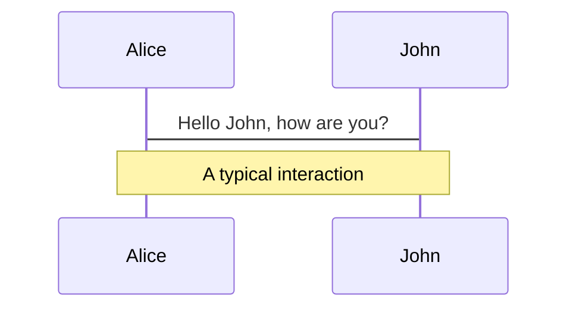
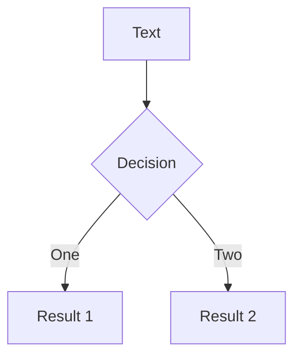
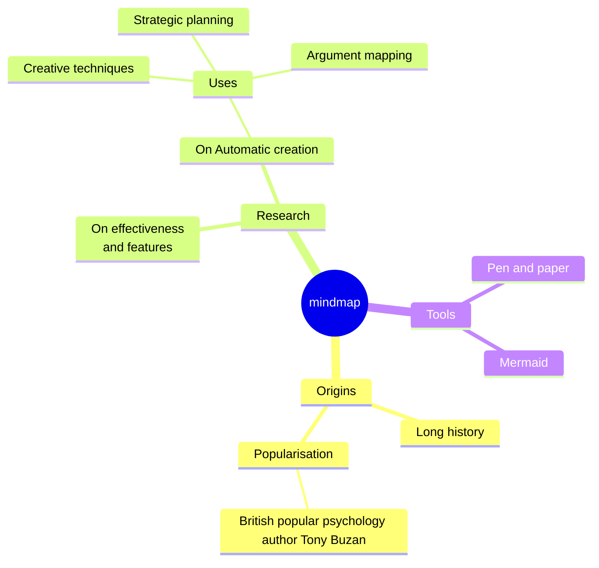
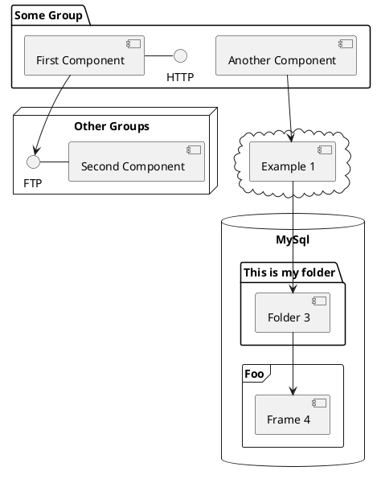

---
# try also 'default' to start simple
theme: seriph
# random image from a curated Unsplash collection by Anthony
# like them? see https://unsplash.com/collections/94734566/slidev
background: fondo.png
# some information about your slides (markdown enabled)
title: Welcome to Slidev
info: |
  ## Slidev Starter Template
  Presentation slides for developers.

  Learn more at [Sli.dev](https://sli.dev)
# apply UnoCSS classes to the current slide
class: text-center
# https://sli.dev/features/drawing
drawings:
  persist: false
# slide transition: https://sli.dev/guide/animations.html#slide-transitions
transition: slide-left
# enable MDC Syntax: https://sli.dev/features/mdc
mdc: true
# duration of the presentation
duration: 35min
---

# CRACKER

JUANITA Y ABRIL

<div @click="$slidev.nav.next" class="mt-12 py-1" hover:bg="white op-10">
  Press Space for next page <carbon:arrow-right />
</div>

<div class="abs-br m-6 text-xl">
  <button @click="$slidev.nav.openInEditor()" title="Open in Editor" class="slidev-icon-btn">
    <carbon:edit />
  </button>
  <a href="https://github.com/slidevjs/slidev" target="_blank" class="slidev-icon-btn">
    <carbon:logo-github />
  </a>
</div>


---
transition: fade-out
---

#  ¿Qué es un Cracker?

- Un crácker es alguien que rompe la seguridad de computadoras, redes o programas con el objetivo de causar daño, robar información o alterar el funcionamiento de los sistemas. A diferencia del hacker ético, que busca mejorar la seguridad, el crácker actúa sin permiso y con malas intenciones.

<br>
<br>

<style>
h1 {
  background-color: #2B90B6;
  background-image: linear-gradient(45deg, #4EC5D4 10%, #146b8c 20%);
  background-size: 100%;
  -webkit-background-clip: text;
  -moz-background-clip: text;
  -webkit-text-fill-color: transparent;
  -moz-text-fill-color: transparent;
}
</style>


---
layout: image-right
image: actividad.png
transition: slide-up
level: 2
---

# Actividades comunes 

  1.	Robo de información (como contraseñas o datos bancarios)
  <br>
	2.	Difusión de malware (virus, troyanos, ransomware, etc.).
  <br>
	3.	Ataques a páginas web (defacement o sabotaje).
  <br>
	4.	Piratería de software (romper licencias o protecciones de programas).
  <br>
	5.	Acceso no autorizado a redes privadas.


---
layout: image-left
image: tipos.jpg
layoutClass: gap-16
---

# Tipos de Crackers

- Cracker de software: elimina protecciones de programas (por ejemplo, versiones “pirata”).
<br>
- Cracker de contraseñas: intenta descifrar claves mediante programas automáticos.
<br>
- Cracker de redes: invade redes inalámbricas o empresariales.
<br>
- Cracker de hardware: manipula dispositivos físicos para vulnerar su seguridad.
<br>

---
layout: image-right
image: diferiencia.jpg
---

# Diferencia entre Cracker y Hacker


- HACKER 
Positiva, busca mejorar seguridad Tiene permiso del dueño del sistema Protección y fortalecimiento de sistemas

- CRACKER
Negativa, busca dañar o robar
Actúa sin permiso
Daño, pérdida o robo de información


---
layout: image-right
image: famoso.jpg
level: 2
---

# Famosos crackers

Ejemplos famosos de cráckers
- Kevin Mitnick: uno de los más conocidos en los años 90; vulneró sistemas de empresas telefónicas y del gobierno.
- Gary McKinnon: accedió ilegalmente a sistemas de la NASA y el Pentágono.


---

# Caso


La historia de George Hotz (MuscleNerd)
El inicio: En 2007, George Hotz, conocido como "GeoHot", logró realizar el primer desbloqueo completo de un iPhone.
El proceso: Su método implicó soldar componentes directamente en la placa base del teléfono, algo que requirió habilidades técnicas avanzadas.
Las consecuencias: Esta hazaña le permitió usar el iPhone con cualquier compañía de telefonía y generó un gran interés en la comunidad tecnológica.
¿Desaparecido?: Después del éxito, Hotz se convirtió en una figura muy conocida y respetada en la comunidad de la tecnología, pero su fama y notoriedad empezaron a disminuir después de que la empresa Apple lanzara actualizaciones de software y el mercado de smartphones madurara. 


---
class: px-20
---


# ¿Por qué "MuscleNerd" es diferente a otros hackers?


Puso a Apple contra las cuerdas: Hotz, con su método de "jailbreak", demostró que no era imposible acceder y modificar el sistema de seguridad de Apple.
Una gran comunidad: Su logro inspiró a un gran número de desarrolladores y hackers de todo el mundo a participar en el movimiento de "jailbreak", creando un ecosistema de herramientas y aplicaciones que ampliaban las funcionalidades del iPhone. 
¿Qué pasó después?
Actividad: A pesar de que su fama disminuyó, Hotz continuó activamente en la escena tecnológica, trabajando en varios proyectos innovadores.
El futuro: Años después, en 2015, publicó un vídeo que anunciaba su salida de la escena del "jailbreak" y se centró en desarrollar tecnología para coches autónomos.

---
theme: seriph
---


---

# Clicks Animations


---

# Motions

Motion animations are powered by [@vueuse/motion](https://motion.vueuse.org/), triggered by `v-motion` directive.

```html
<div
  v-motion
  :initial="{ x: -80 }"
  :enter="{ x: 0 }"
  :click-3="{ x: 80 }"
  :leave="{ x: 1000 }"
>
  Slidev
</div>
```

<div class="w-60 relative">
  <div class="relative w-40 h-40">
    
    
    
  </div>

  <div
    class="text-5xl absolute top-14 left-40 text-[#2B90B6] -z-1"
    v-motion
    :initial="{ x: -80, opacity: 0}"
    :enter="{ x: 0, opacity: 1, transition: { delay: 2000, duration: 1000 } }">
    Slidev
  </div>
</div>

<!-- vue script setup scripts can be directly used in markdown, and will only affects current page -->
<script setup lang="ts">
const final = {
  x: 0,
  y: 0,
  rotate: 0,
  scale: 1,
  transition: {
    type: 'spring',
    damping: 10,
    stiffness: 20,
    mass: 2
  }
}
</script>

<div
  v-motion
  :initial="{ x:35, y: 30, opacity: 0}"
  :enter="{ y: 0, opacity: 1, transition: { delay: 3500 } }">

[Learn more](https://sli.dev/guide/animations.html#motion)

</div>

---

# $\LaTeX$

$\LaTeX$ is supported out-of-box. Powered by [$\KaTeX$](https://katex.org/).

<div h-3 />

Inline $\sqrt{3x-1}+(1+x)^2$

Block
$$ {1|3|all}
\begin{aligned}
\nabla \cdot \vec{E} &= \frac{\rho}{\varepsilon_0} \\
\nabla \cdot \vec{B} &= 0 \\
\nabla \times \vec{E} &= -\frac{\partial\vec{B}}{\partial t} \\
\nabla \times \vec{B} &= \mu_0\vec{J} + \mu_0\varepsilon_0\frac{\partial\vec{E}}{\partial t}
\end{aligned}
$$

[Learn more](https://sli.dev/features/latex)

---

# Diagrams

You can create diagrams / graphs from textual descriptions, directly in your Markdown.

<div class="grid grid-cols-4 gap-5 pt-4 -mb-6">









</div>

Learn more: [Mermaid Diagrams](https://sli.dev/features/mermaid) and [PlantUML Diagrams](https://sli.dev/features/plantuml)

---
foo: bar
dragPos:
  square: 691,32,167,_,-16
---

# Draggable Elements

Double-click on the draggable elements to edit their positions.

<br>

###### Directive Usage

```md

```

<br>

###### Component Usage

```md
<v-drag text-3xl>
  <div class="i-carbon:arrow-up" />
  Use the `v-drag` component to have a draggable container!
</v-drag>
```

<v-drag pos="663,206,261,_,-15">
  <div text-center text-3xl border border-main rounded>
    Double-click me!
  </div>
</v-drag>


###### Draggable Arrow

```md
<v-drag-arrow two-way />
```

<v-drag-arrow pos="67,452,253,46" two-way op70 />

---
src: ./pages/imported-slides.md
hide: false
---

---

# Monaco Editor

Slidev provides built-in Monaco Editor support.

Add `{monaco}` to the code block to turn it into an editor:

```ts {monaco}
import { ref } from 'vue'
import { emptyArray } from './external'

const arr = ref(emptyArray(10))
```

Use `{monaco-run}` to create an editor that can execute the code directly in the slide:

```ts {monaco-run}
import { version } from 'vue'
import { emptyArray, sayHello } from './external'

sayHello()
console.log(`vue ${version}`)
console.log(emptyArray<number>(10).reduce(fib => [...fib, fib.at(-1)! + fib.at(-2)!], [1, 1]))
```

---
layout: center
class: text-center
---

# Learn More

[Documentation](https://sli.dev) · [GitHub](https://github.com/slidevjs/slidev) · [Showcases](https://sli.dev/resources/showcases)

<PoweredBySlidev mt-10 />
